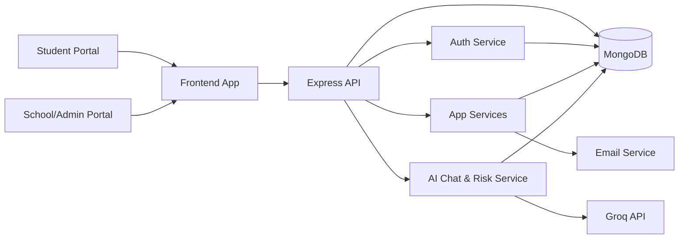
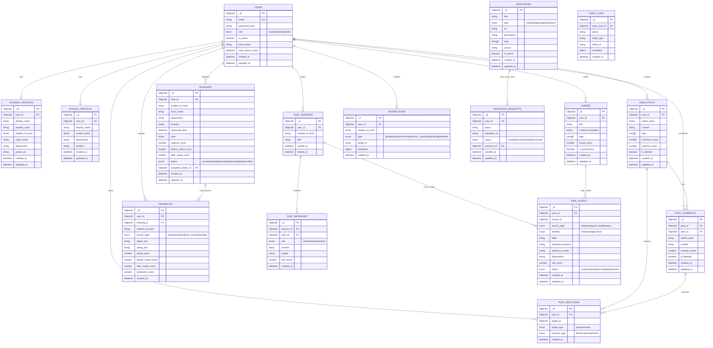

# MindConnect - Thiết Kế Stack Công Nghệ, Cấu Trúc Thư Mục Và Cơ Sở Dữ Liệu

## 1. Định Hướng Dự Án

MindConnect là nền tảng hỗ trợ sức khỏe tinh thần cho sinh viên. Hệ thống có hai cổng chính:

- Cổng sinh viên: nhật ký cá nhân, bảng tin cộng đồng, chat AI, thư viện tài nguyên, đặt lịch tư vấn, thống kê cá nhân và gửi phản hồi.
- Cổng nhà trường/admin: dashboard tổng quan, chủ đề nổi bật, hàng đợi tư vấn, chỉ số hiệu quả can thiệp và báo cáo phản hồi ẩn danh.

Codebase hiện tại đã là một prototype có thể chạy được với HTML/CSS/JavaScript tĩnh, Node.js/Express, MongoDB/Mongoose, xác thực JWT và chat AI qua Groq. Thiết kế dưới đây giữ đúng hướng đang có, nhưng tổ chức lại sạch hơn để dự án có thể phát triển tiếp sau mức prototype.

## 2. Stack Công Nghệ Đề Xuất

### Frontend

| Tầng | Công nghệ đề xuất | Lý do |
|---|---|---|
| UI framework | React + Vite + TypeScript | Phù hợp với hệ thống có nhiều màn hình student/admin, dễ tái sử dụng component, build nhanh và dễ bảo trì hơn các file JavaScript lớn. |
| Styling | CSS Modules hoặc Tailwind CSS | Giúp style rõ phạm vi, dễ kiểm soát. Tailwind nhanh cho prototype; CSS Modules gần với cách viết CSS hiện tại hơn. |
| Routing | React Router | Quản lý route student/admin, trang cần đăng nhập và điều hướng theo vai trò. |
| State | Zustand hoặc React Query | Zustand cho state cục bộ; React Query cho cache API, trạng thái loading và retry. |
| Form | React Hook Form + Zod | Validate rõ ràng cho đăng nhập, đăng ký, diary, booking và feedback. |
| Biểu đồ | Recharts | Dễ dựng biểu đồ mood, engagement, top topics và hiệu quả can thiệp. |
| Testing | Vitest + React Testing Library + Playwright | Unit test logic, test component và test end-to-end cho các luồng chính. |

### Backend

| Tầng | Công nghệ đề xuất | Lý do |
|---|---|---|
| Runtime | Node.js LTS | Phù hợp với backend hiện tại và hệ sinh thái JavaScript. |
| API framework | Express.js + TypeScript | Giữ kiến trúc Express hiện có nhưng tăng độ an toàn nhờ type. |
| Validation | Zod hoặc Joi | Chặn payload không hợp lệ trước khi đi vào service/model. |
| Xác thực | JWT access token + refresh token | Luồng JWT hiện tại phù hợp MVP; refresh token giúp session an toàn hơn. |
| Hash mật khẩu | bcrypt hoặc argon2 | bcrypt hiện tại ổn; argon2 mạnh hơn nếu muốn nâng cấp. |
| ODM database | Mongoose | Đã dùng trong dự án và phù hợp với MongoDB. |
| AI provider | Groq API gọi qua backend service | Không lộ API key ở trình duyệt và cho phép kiểm tra an toàn trước/sau khi gọi AI. |
| Email | Nodemailer hoặc SendGrid | Phục vụ quên mật khẩu và thông báo lịch tư vấn. |
| Xử lý ảnh/file | Sharp + object storage | Sharp đã có trong backend. Khi production nên lưu avatar/media ở S3-compatible storage hoặc Cloudinary. |

### Database Và Hạ Tầng

| Nhu cầu | Công nghệ đề xuất | Lý do |
|---|---|---|
| Database chính | MongoDB Atlas | Linh hoạt cho diary, chat, resource và analytics event; khớp với Mongoose hiện tại. |
| Cache/queue, tùy chọn | Redis + BullMQ | Dùng sau này cho job phân tích AI, gửi email và tổng hợp dashboard. |
| Deploy | Render/Railway/Fly.io cho API, Vercel/Netlify cho frontend | Dễ triển khai cho đồ án sinh viên. |
| Monitoring | Sentry + structured logs | Theo dõi lỗi frontend, API và AI. |
| Secrets | `.env` local, platform secrets khi deploy | Không đưa JWT/Groq/Mongo credentials vào source code. |

### Tóm Tắt Stack Nên Chọn

Với phạm vi SE104 hiện tại:

```text
Frontend: React + Vite + TypeScript + React Router + Recharts
Backend: Node.js + Express + TypeScript + Mongoose
Database: MongoDB Atlas
Auth: JWT + bcrypt
AI: Groq API qua backend service
Testing: Vitest + Playwright
Deployment: Vercel/Netlify frontend + Render/Railway backend
```

Nếu thời gian hạn chế, frontend HTML/JS tĩnh hiện tại vẫn có thể giữ để demo. Các cải tiến backend có giá trị nhất là tách route rõ hơn, thêm validation, siết phân quyền admin và chuẩn hóa schema database.

## 3. Kiến Trúc Tổng Quan



## 4. Cấu Trúc Thư Mục Mục Tiêu

Cấu trúc đề xuất nếu refactor dự án thành monorepo sạch hơn:

```text
MindConnectSE104/
  apps/
    web/
      public/
        images/
      src/
        app/
          App.tsx
          routes.tsx
          providers.tsx
        assets/
        components/
          common/
          layout/
          forms/
          charts/
        features/
          auth/
            api.ts
            components/
            pages/
            types.ts
          student/
            dashboard/
            diary/
            feed/
            chat/
            resources/
            booking/
            profile/
            stats/
          admin/
            dashboard/
            consultations/
            feedback/
            reports/
        hooks/
        lib/
          apiClient.ts
          authStorage.ts
          date.ts
        styles/
        tests/
      index.html
      package.json
      vite.config.ts

    api/
      src/
        config/
          env.ts
          database.ts
        modules/
          auth/
            auth.controller.ts
            auth.routes.ts
            auth.service.ts
            user.model.ts
            user.repository.ts
          profile/
          diary/
          feed/
          chat/
          resources/
          booking/
          feedback/
          dashboard/
          risk/
          interactions/
        middlewares/
          authenticate.ts
          requireRole.ts
          errorHandler.ts
          validateRequest.ts
        shared/
          errors.ts
          logger.ts
          pagination.ts
          studentHash.ts
        app.ts
        server.ts
      tests/
        integration/
        unit/
      package.json
      tsconfig.json

  packages/
    shared/
      src/
        roles.ts
        apiTypes.ts
        validators.ts

  docs/
    use-cases.md
    architecture.md
    database.md
    api-contract.md

  infra/
    docker-compose.yml
    mongo-init/

  .env.example
  README.md
```

### Cấu Trúc Nhẹ Hơn Cho Repo Hiện Tại

Nếu muốn giữ frontend tĩnh hiện tại và chỉ sắp xếp lại dần:

```text
MindConnectSE104/
  frontend/
    index.html
    student.html
    school.html
    assets/
    css/
    js/
      api/
      auth/
      student/
      school/
      shared/

  backend/
    src/
      config/
      controllers/
      middlewares/
      models/
      repositories/
      routes/
      services/
      utils/
    data/
    tests/

  docs/
  tests/
  tools/
```

## 5. Thiết Kế Cơ Sở Dữ Liệu

Vì dự án hiện đã dùng MongoDB và Mongoose, database được thiết kế theo các collection có tham chiếu bằng ObjectId. Schema bên dưới là mô hình logic; mỗi collection có thể ánh xạ trực tiếp thành một Mongoose model.

### Các Collection Chính

| Collection | Mục đích |
|---|---|
| `users` | Tài khoản đăng nhập và phân quyền. |
| `student_profiles` | Thông tin hồ sơ sinh viên, avatar, lớp và khoa. |
| `school_profiles` | Hồ sơ nhà trường/admin và thông tin đơn vị. |
| `diaries` | Nhật ký riêng tư và mood log của sinh viên. |
| `feed_posts` | Bài viết công khai trên bảng tin sinh viên. |
| `post_comments` | Bình luận dưới bài viết công khai. |
| `post_reactions` | Reaction cho bài viết hoặc bình luận. |
| `resources` | Video, blog, sách, podcast và công cụ hỗ trợ. |
| `resource_requests` | Yêu cầu resource hoặc link do sinh viên import. |
| `chat_sessions` | Phiên trò chuyện với AI. |
| `chat_messages` | Tin nhắn user/assistant trong từng phiên chat. |
| `risk_alerts` | Cảnh báo an toàn tạo từ diary/chat/quick test. |
| `bookings` | Yêu cầu đặt lịch tư vấn và trạng thái xử lý. |
| `feedbacks` | Báo cáo ẩn danh, đánh giá và phản hồi sau tư vấn. |
| `interactions` | Sự kiện analytics dùng để tính engagement dashboard. |
| `audit_logs` | Nhật ký thao tác của admin/hệ thống để truy vết. |

## 6. Sơ Đồ ERD



## 7. Ghi Chú Thiết Kế Mongoose Model

### `users`

- Chỉ lưu password hash, tuyệt đối không lưu mật khẩu gốc.
- `email` nên unique và luôn chuyển về lowercase.
- `role` dùng để kiểm soát quyền truy cập route.
- Thêm `is_active` để khóa tài khoản mà không cần xóa dữ liệu.

### `student_profiles`

- Tách thông tin hiển thị cá nhân khỏi thông tin xác thực.
- Dùng `student_id_hash` cho báo cáo ẩn danh trên dashboard.
- Admin dashboard nên dùng mã hash và dữ liệu tổng hợp, không hiển thị nội dung diary riêng tư.

### `diaries`

- Diary phải là riêng tư theo mặc định.
- Nếu cần mức riêng tư production-ready, nên mã hóa `content` ở tầng ứng dụng.
- Dashboard admin chỉ nên dùng tag, mood score, risk score và số liệu tổng hợp.

### `feed_posts`

- Tách bài viết công khai khỏi nhật ký riêng tư.
- Không nên dùng diary làm feed công khai, trừ khi sinh viên chủ động chọn đăng công khai.

### `risk_alerts`

- Giữ `source_type` và `source_id` để biết cảnh báo đến từ đâu.
- Route xem/cập nhật cảnh báo phải chỉ cho `school` và `admin`.
- Tránh hiển thị nội dung nhạy cảm thô nếu chưa có quy trình an toàn và phân quyền rõ ràng.

### `interactions`

- Collection này phục vụ analytics mà không làm nặng các bảng nghiệp vụ chính.
- Dùng để tính xu hướng engagement, lượt xem resource, hoạt động feed và dashboard metrics.

## 8. Index Database Đề Xuất

```javascript
// users
{ email: 1 }, { unique: true }
{ role: 1, created_at: -1 }

// student_profiles
{ user_id: 1 }, { unique: true }
{ student_id_hash: 1 }, { unique: true }
{ department: 1, class_name: 1 }

// diaries
{ user_id: 1, created_at: -1 }
{ tags: 1, created_at: -1 }
{ mood_score: 1, created_at: -1 }

// feed_posts
{ created_at: -1 }
{ user_id: 1, created_at: -1 }
{ tags: 1, created_at: -1 }

// post_comments
{ post_id: 1, created_at: 1 }

// post_reactions
{ user_id: 1, target_type: 1, target_id: 1 }, { unique: true }

// chat
{ user_id: 1, started_at: -1 }
{ session_id: 1, created_at: 1 }

// bookings
{ status: 1, created_at: -1 }
{ student_id_hash: 1, created_at: -1 }
{ department: 1, status: 1 }

// risk_alerts
{ status: 1, severity: 1, created_at: -1 }
{ student_id_hash: 1, created_at: -1 }
{ department: 1, created_at: -1 }

// feedbacks
{ created_at: -1 }
{ booking_id: 1 }
{ sentiment_score: 1, created_at: -1 }

// interactions
{ type: 1, created_at: -1 }
{ student_id_hash: 1, created_at: -1 }
{ target_id: 1 }
```

## 9. Thiết Kế API Theo Module

Các REST endpoint đề xuất:

```text
Auth
POST   /auth/register
POST   /auth/login
POST   /auth/refresh
POST   /auth/logout
POST   /auth/forgot-password
POST   /auth/reset-password

Hồ sơ sinh viên
GET    /api/me
PATCH  /api/me/profile
POST   /api/me/avatar

Diary
GET    /api/diaries/my
POST   /api/diaries
GET    /api/diaries/:id
PATCH  /api/diaries/:id
DELETE /api/diaries/:id
POST   /api/diaries/tags

Bảng tin công khai
GET    /api/feed
POST   /api/feed/posts
PATCH  /api/feed/posts/:id
DELETE /api/feed/posts/:id
POST   /api/feed/posts/:id/comments
POST   /api/feed/posts/:id/reactions
POST   /api/feed/comments/:id/reactions

Chat AI
GET    /chat/sessions
POST   /chat/sessions
GET    /chat/sessions/:id/messages
POST   /chat/support
DELETE /chat/sessions/:id

Resources
GET    /api/resources
POST   /api/resources/import
POST   /api/resources/request
POST   /api/resources/:id/view

Booking
GET    /api/bookings/my
POST   /api/bookings
PATCH  /api/bookings/:id

Feedback
POST   /api/feedback
GET    /api/feedback

Admin
GET    /api/dashboard
GET    /api/risk-alerts
PATCH  /api/risk-alerts/:id
GET    /api/reports/weekly
```

## 10. Quy Tắc Riêng Tư Và An Toàn

- Diary của sinh viên là riêng tư theo mặc định.
- Public feed và diary nên là hai model khác nhau.
- Dashboard admin nên hiển thị số liệu tổng hợp, hash ẩn danh và hàng đợi xử lý, không hiển thị nội dung diary riêng tư.
- AI chat không được chẩn đoán bệnh, kê thuốc hoặc thay thế chuyên gia sức khỏe tinh thần.
- Tín hiệu tự hại mức nghiêm trọng nên bỏ qua luồng AI thông thường và trả về phản hồi an toàn ngay.
- Risk alert chỉ hiển thị cho role `school` và `admin`.
- API key của AI provider chỉ được lưu ở backend.
- Cần có audit log cho thao tác admin trên risk alert và booking.

## 11. Lộ Trình Triển Khai

### Giai Đoạn 1 - Ổn Định Prototype Hiện Tại

- Giữ frontend HTML/CSS/JS hiện tại.
- Làm sạch các module backend và thêm request validation.
- Thêm index vào Mongoose schema.
- Tách public feed khỏi private diary.
- Siết chặt route chỉ dành cho admin.
- Thêm Playwright test cơ bản cho đăng nhập, diary, chat, booking và admin dashboard.

### Giai Đoạn 2 - Refactor Frontend

- Chuyển frontend sang `apps/web` với React + Vite + TypeScript.
- Tách các file JavaScript lớn thành module theo feature.
- Thêm API client dùng chung, auth guard và route theo vai trò.
- Thay dashboard mock bằng component render từ API.

### Giai Đoạn 3 - Làm Cứng Cho Production

- Thêm refresh token và cơ chế vô hiệu hóa token khi logout.
- Mã hóa nội dung diary.
- Thêm audit logs.
- Thêm Redis job queue cho phân tích AI và báo cáo tuần.
- Thêm object storage cho avatar/media.
- Thêm CI pipeline cho lint, test và build.
