# MindConnect - Use Case Specification

Tài liệu này được tổng hợp trực tiếp từ mã nguồn hiện tại của dự án MindConnect, gồm:

- `index.html`: đăng nhập, đăng ký, quên mật khẩu và phân tách vai trò.
- `student.html`, `student.js`: portal sinh viên.
- `school.html`, `school.js`: admin portal cho nhà trường/người quản lý.
- `backend/src/routes`, `backend/src/controllers`, `backend/src/models`, `backend/src/services`: API, lưu trữ, AI chat, dashboard, booking, feedback.

## 1. Phạm Vi Hệ Thống

MindConnect là hệ thống hỗ trợ sức khỏe tinh thần cho sinh viên. Hệ thống cho phép sinh viên ghi nhật ký riêng tư, đăng bài cộng đồng, trò chuyện với AI, xem tài nguyên, đặt lịch hỗ trợ và gửi feedback. Nhà trường/người quản lý sử dụng admin portal để theo dõi dữ liệu tổng hợp, chủ đề nổi bật, hiệu quả can thiệp, yêu cầu hỗ trợ và feedback.

## 2. Actor

| Actor | Vai trò trong hệ thống |
|---|---|
| Khách truy cập | Người chưa đăng nhập, có thể xem landing page, chuyển form, đăng ký, đăng nhập, quên mật khẩu. |
| Sinh viên | Người dùng chính của student portal. Có thể quản lý hồ sơ, đăng bài, ghi diary, chat AI, xem resources, xem stats, đặt lịch và gửi feedback. |
| Nhà trường / Người quản lý / Admin | Người dùng school portal. Có thể xem dashboard tổng hợp, quản lý yêu cầu hỗ trợ, xem hiệu quả can thiệp, xem feedback và xuất báo cáo. |
| MindConnect AI | Tác nhân AI hỗ trợ phản hồi chat, phân tích cảm xúc hôm nay trong Stats, gợi ý tài nguyên phù hợp. |
| Hệ thống MindConnect | Thành phần tự động xác thực, phân quyền, lưu dữ liệu, hash sinh viên, ghi nhận tương tác, tính metric, tính sentiment, xếp hạng yêu cầu hỗ trợ. |
| Dịch vụ email | Tác nhân ngoài hỗ trợ gửi email đặt lại mật khẩu. |
| Nguồn tài nguyên bên ngoài | Website/video/blog/book/podcast được sinh viên mở hoặc import bằng link. |
| Cơ sở dữ liệu / Local storage | Nơi lưu người dùng, diary, booking, feedback, interaction, chat log; có fallback local khi MongoDB/backend không sẵn sàng. |

## 3. Use Case Diagram Gợi Ý

Bạn có thể dùng đoạn PlantUML sau để vẽ use case diagram trong báo cáo:

```plantuml
@startuml
left to right direction

actor "Khách truy cập" as Guest
actor "Sinh viên" as Student
actor "Nhà trường / Admin" as Admin
actor "MindConnect AI" as AI
actor "Dịch vụ email" as Email
actor "Nguồn tài nguyên ngoài" as ExternalResource

rectangle "MindConnect" {
  usecase "Đăng ký tài khoản" as UC01
  usecase "Đăng nhập theo vai trò" as UC02
  usecase "Quên mật khẩu" as UC03
  usecase "Đăng xuất" as UC04

  usecase "Đổi ảnh tài khoản" as UC05
  usecase "Đổi tên hiển thị" as UC06
  usecase "Xem bảng tin" as UC07
  usecase "Tạo bài viết mới" as UC08
  usecase "React bài viết" as UC09
  usecase "Bình luận bài viết" as UC10
  usecase "React bình luận" as UC11
  usecase "Xem danh sách bình luận" as UC12
  usecase "Xem bài viết của người dùng cụ thể" as UC13
  usecase "Ghi Diary riêng tư" as UC14
  usecase "Thêm tag cho Diary" as UC15
  usecase "Ghi nhận cảm xúc hiện tại" as UC16
  usecase "Xem lại Diary trong popup" as UC17
  usecase "Xem thống kê cảm xúc" as UC18
  usecase "Chat với AI hỗ trợ" as UC19
  usecase "Xem lịch sử chat với AI của bản thân" as UC20
  usecase "Xem tài nguyên" as UC21
  usecase "Lọc tài nguyên" as UC22
  usecase "Import resource bằng link" as UC23
  usecase "Request resource theo nhu cầu" as UC24
  usecase "Thực hành bài tập thở" as UC25
  usecase "Đặt lịch tư vấn" as UC26
  usecase "Gửi feedback" as UC27

  usecase "Xem dashboard tổng quan" as UC28
  usecase "Xem Top 5 chủ đề nổi bật" as UC29
  usecase "Xem AI Report" as UC30
  usecase "Quản lý yêu cầu hỗ trợ" as UC31
  usecase "Xem hiệu quả can thiệp" as UC32
  usecase "Xem báo cáo & feedback" as UC33
  usecase "Xuất dữ liệu / tạo báo cáo tuần" as UC34

  usecase "Xác thực & phân quyền" as UC35
  usecase "Ghi nhận tương tác" as UC36
  usecase "Tính metric dashboard" as UC37
  usecase "Phân tích sentiment / topic" as UC38
  usecase "Gọi Groq API" as UC39
  usecase "Gửi email reset password" as UC40
  usecase "Tạo cảnh báo" as UC41
}

Guest --> UC01
Guest --> UC02
Guest --> UC03

Student --> UC04
Student --> UC05
Student --> UC06
Student --> UC07
Student --> UC08
Student --> UC09
Student --> UC10
Student --> UC11
Student --> UC12
Student --> UC13
Student --> UC14
Student --> UC15
Student --> UC16
Student --> UC17
Student --> UC18
Student --> UC19
Student --> UC20
Student --> UC21
Student --> UC22
Student --> UC23
Student --> UC24
Student --> UC25
Student --> UC26
Student --> UC27

Admin --> UC04
Admin --> UC28
Admin --> UC29
Admin --> UC30
Admin --> UC31
Admin --> UC32
Admin --> UC33
Admin --> UC34

UC01 .> UC35 : <<include>>
UC02 .> UC35 : <<include>>
UC03 .> UC40 : <<include>>
UC10 .> UC12 : <<include>>
UC11 .> UC12 : <<include>>
UC13 .> UC07 : <<extend>>
UC08 .> UC36 : <<include>>
UC09 .> UC36 : <<include>>
UC10 .> UC36 : <<include>>
UC11 .> UC36 : <<include>>
UC14 .> UC15 : <<include>>
UC14 .> UC16 : <<include>>
UC14 .> UC36 : <<include>>
UC18 .> UC39 : <<extend>>
UC19 .> UC39 : <<include>>
UC19 .> UC41 : <<extend>>
UC21 --> ExternalResource
UC21 .> UC36 : <<include>>
UC22 .> UC21 : <<extend>>
UC23 --> ExternalResource
UC24 --> ExternalResource
UC26 .> UC36 : <<include>>
UC27 .> UC36 : <<include>>
UC28 .> UC37 : <<include>>
UC29 .> UC38 : <<include>>
UC30 .> UC38 : <<include>>
UC31 .> UC37 : <<include>>

UC35 --> Store
UC36 --> Store
UC37 --> Store
UC38 --> Store
UC39 --> AI
UC40 --> Email
@enduml
```

## 4. Danh Sách Use Case Tổng Quan

| ID | Use case | Actor chính | Mục tiêu |
|---|---|---|---|
| UC-01 | Đăng ký tài khoản | Khách truy cập | Tạo tài khoản sinh viên hoặc nhà trường/người quản lý. |
| UC-02 | Đăng nhập theo vai trò | Khách truy cập | Truy cập đúng portal theo role. |
| UC-03 | Quên mật khẩu | Khách truy cập | Yêu cầu email đặt lại mật khẩu. |
| UC-04 | Đăng xuất | Sinh viên, Admin | Xóa phiên đăng nhập và quay về landing/login. |
| UC-05 | Đổi ảnh tài khoản | Sinh viên | Upload/cập nhật avatar cá nhân. |
| UC-06 | Đổi tên hiển thị | Sinh viên | Cập nhật tên hiển thị dùng trên nav, bài viết và bình luận. |
| UC-07 | Xem bảng tin | Sinh viên | Xem danh sách bài viết công khai trên Home. |
| UC-08 | Tạo bài viết mới | Sinh viên | Đăng bài công khai lên Home kèm tag thủ công. |
| UC-09 | React bài viết | Sinh viên | Thả cảm xúc/like cho bài viết. |
| UC-10 | Bình luận bài viết | Sinh viên | Gửi comment dưới bài viết. |
| UC-11 | React bình luận | Sinh viên | Thả like/reaction cho bình luận. |
| UC-12 | Xem danh sách bình luận | Sinh viên | Mở/xem các comment đã có dưới bài viết. |
| UC-13 | Xem bài viết của người dùng cụ thể | Sinh viên | Lọc/xem các bài viết thuộc một tác giả cụ thể. |
| UC-14 | Ghi Diary riêng tư | Sinh viên | Lưu nội dung nhật ký riêng tư của user. |
| UC-15 | Thêm tag cho Diary | Sinh viên | Gắn tag thủ công cho diary trước khi lưu. |
| UC-16 | Ghi nhận cảm xúc hiện tại | Sinh viên | Chọn mood/cảm xúc hiện tại khi ghi diary. |
| UC-17 | Xem lại Diary trong popup | Sinh viên | Mở đúng bài diary gần đây trong modal. |
| UC-18 | Xem thống kê cảm xúc | Sinh viên | Theo dõi cảm xúc 7 ngày và phân tích hôm nay. |
| UC-19 | Chat với AI hỗ trợ | Sinh viên | Nhận phản hồi tư vấn nhẹ nhàng từ AI. |
| UC-20 | Xem lịch sử chat với AI của bản thân | Sinh viên | Xem lại các cuộc trò chuyện AI của chính tài khoản đang đăng nhập. |
| UC-21 | Xem tài nguyên | Sinh viên | Duyệt danh sách video, blog, book, podcast, công cụ. |
| UC-22 | Lọc tài nguyên | Sinh viên | Lọc tài nguyên theo loại hoặc nhu cầu. |
| UC-23 | Import resource bằng link | Sinh viên | Tự thêm tài nguyên vào thư viện. |
| UC-24 | Request resource theo nhu cầu | Sinh viên | Tìm resource trong thư viện hoặc nguồn học thuật ngoài. |
| UC-25 | Thực hành bài tập thở | Sinh viên | Dùng công cụ thở để giảm căng thẳng. |
| UC-26 | Đặt lịch tư vấn | Sinh viên | Gửi yêu cầu gặp tổ tư vấn/hỗ trợ. |
| UC-27 | Gửi feedback | Sinh viên | Gửi phản hồi ẩn danh cho nhà trường. |
| UC-28 | Xem dashboard tổng quan | Admin | Theo dõi KPI sức khỏe tinh thần và engagement. |
| UC-29 | Xem Top 5 chủ đề nổi bật | Admin | Xem các tag/chủ đề nổi bật từ dữ liệu thật. |
| UC-30 | Xem AI Report | Admin | Xem phân tích tag, tỷ lệ, xu hướng, đề xuất can thiệp. |
| UC-31 | Quản lý yêu cầu hỗ trợ | Admin | Xử lý booking/yêu cầu hỗ trợ đang chờ. |
| UC-32 | Xem hiệu quả can thiệp | Admin | Đánh giá kết quả hỗ trợ qua booking và feedback. |
| UC-33 | Xem báo cáo & feedback | Admin | Đọc feedback sinh viên và thống kê tích cực/tiêu cực. |
| UC-34 | Xuất dữ liệu/tạo báo cáo tuần | Admin | Xuất JSON hoặc tạo báo cáo dashboard từ dữ liệu live. |
| UC-35 | Xác thực & phân quyền | Hệ thống | Kiểm tra email, mật khẩu, role, JWT/local session. |
| UC-36 | Ghi nhận tương tác | Hệ thống | Lưu interaction phục vụ dashboard engagement. |
| UC-37 | Tính metric dashboard | Hệ thống | Tính sentiment, support requests, engagement, stress reduction. |
| UC-38 | Phân tích sentiment/topic | Hệ thống | Suy luận tag, sentiment, recommendation từ diary/feedback. |
| UC-39 | Gọi Groq API | MindConnect AI | Tạo phản hồi chat hoặc phân tích cảm xúc hôm nay. |
| UC-40 | Gửi email reset password | Dịch vụ email | Gửi link đặt lại mật khẩu. |
| UC-41 | Tạo cảnh báo | Hệ thống | Tạo cảnh báo khi phát hiện tín hiệu tự hại/nguy cấp. |

## 5. Đặc Tả Use Case Chi Tiết

### UC-01. Đăng ký tài khoản

| Thuộc tính | Nội dung |
|---|---|
| Actor chính | Khách truy cập |
| Actor phụ | Hệ thống MindConnect, CSDL/local storage |
| Tiền điều kiện | Người dùng đang ở `index.html`, chưa đăng nhập. |
| Kích hoạt | Người dùng chọn “Đăng ký ngay”. |
| Luồng chính | 1. Người dùng chọn tab Sinh viên hoặc Nhà trường. 2. Nhập tên, email/MSSV, mật khẩu, xác nhận mật khẩu. 3. Hệ thống kiểm tra username, email/MSSV, độ dài mật khẩu và xác nhận mật khẩu. 4. Hệ thống gửi `POST /auth/register`. 5. Backend tạo user, hash password, gán role. 6. Hệ thống báo đăng ký thành công và đưa người dùng về form đăng nhập. |
| Ngoại lệ | Email sai định dạng; mật khẩu dưới 6 ký tự; xác nhận mật khẩu không khớp; tài khoản đã tồn tại; nhà trường dùng MSSV/email sinh viên; backend offline thì frontend fallback localStorage mock. |
| Hậu điều kiện | Tài khoản được tạo trong DB hoặc local mock. |

### UC-02. Đăng nhập theo vai trò

| Thuộc tính | Nội dung |
|---|---|
| Actor chính | Khách truy cập |
| Actor phụ | Hệ thống MindConnect, CSDL/local storage |
| Tiền điều kiện | Người dùng có tài khoản hợp lệ. |
| Kích hoạt | Người dùng nhập tài khoản/mật khẩu và bấm “Truy cập”. |
| Luồng chính | 1. Chọn vai trò Sinh viên hoặc Nhà trường. 2. Nhập email/MSSV và mật khẩu. 3. Frontend chuẩn hóa MSSV thành email sinh viên nếu cần. 4. Gửi `POST /auth/login`. 5. Backend xác thực mật khẩu, kiểm tra role. 6. Frontend lưu `mindconnect:auth`, `mindconnect:role`. 7. Sinh viên chuyển đến `student.html`, nhà trường/admin chuyển đến `school.html`. |
| Ngoại lệ | Sai tài khoản/mật khẩu; tài khoản sinh viên cố vào portal nhà trường; tài khoản nhà trường cố vào portal sinh viên; backend offline thì kiểm tra localStorage mock. |
| Hậu điều kiện | Người dùng có session và token để gọi API. |

### UC-03. Quên mật khẩu

| Thuộc tính | Nội dung |
|---|---|
| Actor chính | Khách truy cập |
| Actor phụ | Dịch vụ email |
| Tiền điều kiện | Người dùng ở form quên mật khẩu. |
| Kích hoạt | Người dùng nhập email và bấm gửi link. |
| Luồng chính | 1. Nhập email. 2. Frontend kiểm tra định dạng. 3. Gửi `POST /auth/forgot-password`. 4. Backend tạo reset token, hash token, set hạn 15 phút. 5. Hệ thống gửi email reset. 6. UI thông báo đã gửi link. |
| Ngoại lệ | Email sai định dạng; backend/email service lỗi. |
| Hậu điều kiện | Nếu email tồn tại, người dùng nhận link reset. |

### UC-04. Đăng xuất

| Thuộc tính | Nội dung |
|---|---|
| Actor chính | Sinh viên, Admin |
| Tiền điều kiện | Đang đăng nhập. |
| Luồng chính | 1. Bấm Log out/Đăng xuất. 2. Hệ thống xóa `mindconnect:auth`, `mindconnect:role`, `authSession`. 3. Chuyển về `index.html`. |
| Hậu điều kiện | Session bị xóa khỏi trình duyệt. |

### UC-05. Đổi ảnh tài khoản

| Thuộc tính | Nội dung |
|---|---|
| Actor chính | Sinh viên |
| Tiền điều kiện | Sinh viên đã đăng nhập student portal. |
| Kích hoạt | Sinh viên mở Profile từ avatar/menu tài khoản. |
| Luồng chính | 1. Hệ thống hiển thị avatar hiện tại. 2. Sinh viên chọn ảnh mới từ thiết bị. 3. Hệ thống kiểm tra định dạng PNG/JPG/WebP/GIF và dung lượng. 4. Hệ thống hiển thị ảnh xem trước. 5. Sinh viên bấm lưu hồ sơ. 6. Hệ thống lưu avatar theo tài khoản. 7. Hệ thống cập nhật avatar ở thanh điều hướng, bài viết Home và bình luận của chính user. |
| Ngoại lệ | File không phải ảnh; ảnh vượt dung lượng cho phép; trình duyệt không đọc được file. |
| Hậu điều kiện | Avatar mới được dùng cho các lần hiển thị hồ sơ, bài đăng và bình luận sau đó. |

### UC-06. Đổi tên hiển thị

| Thuộc tính | Nội dung |
|---|---|
| Actor chính | Sinh viên |
| Tiền điều kiện | Sinh viên đã đăng nhập student portal. |
| Kích hoạt | Sinh viên mở Profile và chỉnh trường tên hiển thị. |
| Luồng chính | 1. Hệ thống hiển thị tên hiện tại. 2. Sinh viên nhập tên hiển thị mới. 3. Hệ thống kiểm tra tên tối thiểu 2 ký tự. 4. Sinh viên bấm lưu hồ sơ. 5. Hệ thống lưu tên theo tài khoản. 6. Hệ thống cập nhật tên ở nav, bài viết Home và bình luận của chính user. |
| Ngoại lệ | Tên rỗng; tên quá ngắn; lưu profile thất bại thì hệ thống giữ tên cũ. |
| Hậu điều kiện | Tên hiển thị mới được dùng ở các khu vực công khai trong student portal. |

### UC-07. Xem bảng tin

| Thuộc tính | Nội dung |
|---|---|
| Actor chính | Sinh viên |
| Tiền điều kiện | Sinh viên đã đăng nhập và mở tab Home. |
| Kích hoạt | Sinh viên chọn tab Home hoặc quay lại Home sau khi dùng chức năng khác. |
| Luồng chính | 1. Hệ thống tải danh sách bài viết công khai từ public feed. 2. Hệ thống hiển thị ô tạo bài viết ở đầu trang. 3. Hệ thống hiển thị từng bài viết với avatar, tên tác giả, thời gian, nội dung, tag, số reaction và số bình luận. 4. Sinh viên cuộn bảng tin để xem thêm bài viết. |
| Ngoại lệ | Chưa có bài viết thì hệ thống hiển thị trạng thái trống hoặc dữ liệu khởi tạo; dữ liệu feed local lỗi thì hệ thống bỏ qua bản ghi hỏng và tiếp tục hiển thị phần còn lại. |
| Hậu điều kiện | Sinh viên nhìn thấy các bài viết công khai mới nhất trên Home. |

### UC-08. Tạo bài viết mới

| Thuộc tính | Nội dung |
|---|---|
| Actor chính | Sinh viên |
| Tiền điều kiện | Sinh viên ở tab Home và có hồ sơ đăng nhập hợp lệ. |
| Kích hoạt | Sinh viên nhập nội dung vào ô tạo bài viết. |
| Luồng chính | 1. Sinh viên nhập nội dung bài viết. 2. Sinh viên nhập tag thủ công và bấm `+ Tag`. 3. Hệ thống kiểm tra nội dung đủ dài và có ít nhất 1 tag. 4. Sinh viên bấm “Đăng lên Home”. 5. Hệ thống tạo bài viết mới với id, nội dung, tag, avatar, tên tác giả và email chủ sở hữu. 6. Hệ thống thêm bài viết vào đầu newsfeed công khai. 7. Hệ thống lưu public feed vào localStorage/backend tương ứng. 8. Hệ thống ghi interaction type `post` để phục vụ thống kê engagement. |
| Ngoại lệ | Nội dung quá ngắn thì báo lỗi; chưa có tag thì yêu cầu thêm tag trước khi đăng; backend không sẵn sàng thì feed local vẫn hoạt động và interaction backend có thể được ghi nhận sau. |
| Hậu điều kiện | Bài viết xuất hiện công khai trong Home và các sinh viên khác có thể nhìn thấy. |

### UC-09. React bài viết

| Thuộc tính | Nội dung |
|---|---|
| Actor chính | Sinh viên |
| Tiền điều kiện | Bài viết đang hiển thị trên Home. |
| Kích hoạt | Sinh viên bấm nút reaction/like của bài viết. |
| Luồng chính | 1. Sinh viên chọn reaction cho bài viết. 2. Hệ thống cập nhật trạng thái reaction của sinh viên trên bài viết đó. 3. Hệ thống tăng hoặc cập nhật số reaction hiển thị. 4. Hệ thống lưu lại public feed. 5. Hệ thống ghi interaction type `reaction`. |
| Ngoại lệ | Nếu sinh viên bấm lại reaction đã chọn, hệ thống có thể bỏ reaction hoặc cập nhật lại trạng thái theo thiết kế UI; nếu ghi nhận interaction thất bại, UI vẫn giữ trạng thái local. |
| Hậu điều kiện | Reaction của bài viết được cập nhật và được tính vào engagement. |

### UC-10. Bình luận bài viết

| Thuộc tính | Nội dung |
|---|---|
| Actor chính | Sinh viên |
| Tiền điều kiện | Bài viết đang hiển thị trên Home. |
| Kích hoạt | Sinh viên mở ô bình luận của một bài viết. |
| Luồng chính | 1. Sinh viên bấm nút bình luận. 2. Hệ thống hiển thị ô nhập bình luận dưới bài viết. 3. Sinh viên nhập nội dung bình luận. 4. Sinh viên gửi bình luận. 5. Hệ thống tạo comment mới với avatar, tên người bình luận, thời gian và nội dung. 6. Hệ thống thêm comment vào đúng bài viết. 7. Hệ thống lưu public feed. 8. Hệ thống ghi interaction type `comment`. |
| Ngoại lệ | Bình luận rỗng hoặc chỉ có khoảng trắng thì không gửi; nếu lưu backend thất bại, hệ thống vẫn có thể giữ comment local và thông báo trạng thái phù hợp. |
| Hậu điều kiện | Bình luận xuất hiện dưới đúng bài viết và được tính vào engagement. |

### UC-11. React bình luận

| Thuộc tính | Nội dung |
|---|---|
| Actor chính | Sinh viên |
| Tiền điều kiện | Bài viết đang có danh sách bình luận hoặc khu vực bình luận đã được mở. |
| Kích hoạt | Sinh viên bấm like/reaction trên một bình luận. |
| Luồng chính | 1. Sinh viên mở danh sách bình luận của bài viết. 2. Sinh viên chọn bình luận cần react. 3. Hệ thống cập nhật trạng thái reaction của sinh viên trên bình luận đó. 4. Hệ thống tăng hoặc cập nhật số reaction của bình luận. 5. Hệ thống lưu lại public feed. 6. Hệ thống ghi interaction type `comment_reaction`. |
| Ngoại lệ | Nếu sinh viên bấm lại reaction đã chọn, hệ thống có thể bỏ reaction hoặc cập nhật lại trạng thái theo thiết kế UI. |
| Hậu điều kiện | Reaction của bình luận được lưu và có thể được tính vào engagement. |

### UC-12. Xem danh sách bình luận

| Thuộc tính | Nội dung |
|---|---|
| Actor chính | Sinh viên |
| Tiền điều kiện | Bài viết có thể có hoặc không có bình luận. |
| Kích hoạt | Sinh viên bấm vào khu vực bình luận hoặc nút xem bình luận của bài viết. |
| Luồng chính | 1. Hệ thống mở khu vực bình luận của bài viết được chọn. 2. Hệ thống tải danh sách comment thuộc đúng bài viết. 3. Hệ thống hiển thị avatar, tên người bình luận, thời gian, nội dung và số like nếu có. 4. Sinh viên đọc các bình luận hiện có và có thể tiếp tục gửi bình luận mới. |
| Ngoại lệ | Nếu bài viết chưa có bình luận, hệ thống hiển thị trạng thái không có bình luận hoặc chỉ hiển thị ô nhập bình luận. |
| Hậu điều kiện | Sinh viên xem được đầy đủ bình luận gắn với bài viết đã chọn. |

### UC-13. Xem bài viết của người dùng cụ thể

| Thuộc tính | Nội dung |
|---|---|
| Actor chính | Sinh viên |
| Tiền điều kiện | Public feed có dữ liệu tác giả như tên, avatar hoặc email chủ sở hữu. |
| Kích hoạt | Sinh viên chọn avatar/tên tác giả của một bài viết. |
| Luồng chính | 1. Sinh viên bấm vào avatar hoặc tên tác giả. 2. Hệ thống xác định người dùng/tác giả tương ứng. 3. Hệ thống lọc public feed theo tác giả hoặc email chủ sở hữu. 4. Hệ thống hiển thị danh sách bài viết công khai của người dùng đó. 5. Sinh viên có thể bỏ lọc để quay lại bảng tin đầy đủ. |
| Ngoại lệ | Nếu tác giả chưa có bài viết công khai khác, hệ thống chỉ hiển thị bài hiện tại hoặc trạng thái trống phù hợp; nếu dữ liệu tác giả thiếu email, hệ thống lọc theo tên hiển thị. |
| Hậu điều kiện | Sinh viên xem được các bài viết công khai thuộc một người dùng cụ thể. |
| Ghi chú triển khai | Dữ liệu bài viết hiện đã có hướng lưu tác giả/avatar/email chủ sở hữu; UI có thể bổ sung thao tác click avatar/tên để kích hoạt bộ lọc này. |

### UC-14. Ghi Diary riêng tư

| Thuộc tính | Nội dung |
|---|---|
| Actor chính | Sinh viên |
| Tiền điều kiện | Sinh viên ở tab Diary. |
| Luồng chính | 1. Sinh viên nhập tiêu đề và nội dung diary. 2. Hệ thống yêu cầu có cảm xúc hiện tại thông qua UC-16. 3. Hệ thống yêu cầu có ít nhất một tag thông qua UC-15. 4. Sinh viên bấm “Lưu nhật ký riêng tư”. 5. Hệ thống kiểm tra nội dung, tag và mood. 6. Diary được lưu vào localStorage riêng theo tài khoản. 7. Backend nhận `POST /api/diaries` để phục vụ phân tích tổng hợp. |
| Ngoại lệ | Nội dung dưới 5 ký tự; chưa có tag; chưa chọn cảm xúc; backend lỗi thì diary riêng tư vẫn lưu local. |
| Hậu điều kiện | Diary chỉ xuất hiện trong tab Diary của user, không xuất hiện trên Home. |

### UC-15. Thêm tag cho Diary

| Thuộc tính | Nội dung |
|---|---|
| Actor chính | Sinh viên |
| Tiền điều kiện | Sinh viên đang tạo hoặc chỉnh nội dung diary. |
| Kích hoạt | Sinh viên nhập tag và bấm `+ Tag`. |
| Luồng chính | 1. Sinh viên nhập tên tag thủ công. 2. Hệ thống chuẩn hóa khoảng trắng và kiểm tra tag không rỗng. 3. Hệ thống thêm tag vào danh sách tag của diary. 4. Sinh viên có thể thêm nhiều tag trước khi lưu diary. |
| Ngoại lệ | Tag rỗng; tag trùng; vượt số lượng tag hợp lý thì hệ thống không thêm mới. |
| Hậu điều kiện | Diary có danh sách tag để phục vụ tìm kiếm, thống kê và phân tích chủ đề. |

### UC-16. Ghi nhận cảm xúc hiện tại

| Thuộc tính | Nội dung |
|---|---|
| Actor chính | Sinh viên |
| Tiền điều kiện | Sinh viên đang ở tab Diary hoặc luồng ghi nhận cảm xúc cá nhân. |
| Kích hoạt | Sinh viên chọn mood/cảm xúc hiện tại. |
| Luồng chính | 1. Hệ thống hiển thị các mức cảm xúc hoặc mood từ 1-5. 2. Sinh viên chọn cảm xúc hiện tại. 3. Hệ thống lưu mood tạm thời vào form diary. 4. Khi diary được lưu, mood được ghi kèm diary để phục vụ Stats. |
| Ngoại lệ | Sinh viên chưa chọn mood thì hệ thống yêu cầu chọn trước khi lưu diary. |
| Hậu điều kiện | Cảm xúc hiện tại được gắn với diary và được dùng cho thống kê cá nhân. |

### UC-17. Xem lại Diary trong popup

| Thuộc tính | Nội dung |
|---|---|
| Actor chính | Sinh viên |
| Tiền điều kiện | Có ít nhất một diary đã lưu. |
| Luồng chính | 1. Vào Diary. 2. Xem danh sách nhật ký gần đây. 3. Click một entry. 4. Hệ thống mở modal/popup đúng diary đó, gồm tiêu đề, thời gian, mood, tag và nội dung. 5. Người dùng đóng popup. |
| Ngoại lệ | Diary không tồn tại hoặc id không khớp thì không mở popup. |

### UC-18. Xem thống kê cảm xúc

| Thuộc tính | Nội dung |
|---|---|
| Actor chính | Sinh viên |
| Actor phụ | MindConnect AI, Hệ thống |
| Luồng chính | 1. Vào tab Stats. 2. Hệ thống lấy nguồn dữ liệu của chính user gồm Diary riêng tư và bài đăng Home của user. 3. Hệ thống loại comment của người khác. 4. Tính điểm cảm xúc 7 ngày. 5. Hiển thị biểu đồ, điểm trung bình và nguồn dữ liệu. 6. Với dữ liệu hôm nay, hệ thống gọi AI backend để phân tích ngắn nếu backend sẵn sàng. |
| Ngoại lệ | Chưa có dữ liệu thì hiển thị trạng thái trống; backend/AI lỗi thì dùng phân tích cục bộ. |
| Hậu điều kiện | Sinh viên nhìn được xu hướng cảm xúc cá nhân. |

### UC-19. Chat với AI hỗ trợ

| Thuộc tính | Nội dung |
|---|---|
| Actor chính | Sinh viên |
| Actor phụ | MindConnect AI/Groq API, Hệ thống |
| Luồng chính | 1. Vào tab Chat. 2. Nhập tin nhắn hoặc chọn gợi ý. 3. Frontend gửi `POST /chat/support` kèm lịch sử gần nhất. 4. Backend kiểm tra message, phát hiện tín hiệu nguy cấp nếu có. 5. Nếu không nguy cấp, backend gọi Groq API. 6. AI trả lời theo ngữ cảnh, bằng tiếng Việt, có thể gợi ý resource. 7. Chat log được lưu khi DB sẵn sàng. |
| Ngoại lệ | Message rỗng; message quá 2000 ký tự; Groq API chưa cấu hình; backend lỗi thì UI báo rõ không giả vờ là AI thật. |
| Hậu điều kiện | Người dùng nhận phản hồi hỗ trợ phù hợp nội dung. |

### UC-20. Xem lịch sử chat với AI của bản thân

| Thuộc tính | Nội dung |
|---|---|
| Actor chính | Sinh viên |
| Tiền điều kiện | Sinh viên đã đăng nhập và từng có ít nhất một phiên chat AI hoặc local chat log. |
| Kích hoạt | Sinh viên mở tab Chat hoặc chọn phần lịch sử chat. |
| Luồng chính | 1. Hệ thống xác định tài khoản đang đăng nhập. 2. Hệ thống tải chat log gắn với chính tài khoản đó từ backend/localStorage. 3. Hệ thống hiển thị tin nhắn của user và phản hồi AI theo thứ tự thời gian. 4. Sinh viên xem lại nội dung cũ và có thể tiếp tục nhắn trong phiên hiện tại. |
| Ngoại lệ | Chưa có lịch sử chat thì hiển thị trạng thái trống; backend chưa sẵn sàng thì dùng lịch sử local nếu có. |
| Hậu điều kiện | Sinh viên xem lại được lịch sử trò chuyện AI của chính mình, không xem lịch sử của user khác. |

### UC-21. Xem tài nguyên

| Thuộc tính | Nội dung |
|---|---|
| Actor chính | Sinh viên |
| Actor phụ | Nguồn tài nguyên bên ngoài |
| Luồng chính | 1. Vào Resources. 2. Hệ thống hiển thị danh sách tài nguyên gồm video, blog, book, podcast, công cụ. 3. Sinh viên bấm một resource để xem chi tiết, mở link ngoài hoặc mở công cụ trong app. 4. Hệ thống ghi interaction `resource_view`. |
| Ngoại lệ | Resource không có URL thì không mở trang ngoài; nguồn ngoài lỗi thì hệ thống vẫn giữ danh sách tài nguyên trong app. |
| Hậu điều kiện | Sinh viên xem được tài nguyên hỗ trợ phù hợp trong thư viện. |

### UC-22. Lọc tài nguyên

| Thuộc tính | Nội dung |
|---|---|
| Actor chính | Sinh viên |
| Tiền điều kiện | Danh sách resource đã được tải trong tab Resources. |
| Kích hoạt | Sinh viên chọn loại tài nguyên, tag hoặc nhập từ khóa lọc. |
| Luồng chính | 1. Sinh viên chọn bộ lọc như Video, Blog, Book, Podcast, Công cụ hoặc nhập từ khóa. 2. Hệ thống lọc danh sách resource hiện có theo tiêu chí. 3. Hệ thống hiển thị số lượng và danh sách kết quả. 4. Sinh viên có thể xóa bộ lọc để quay lại toàn bộ tài nguyên. |
| Ngoại lệ | Không có kết quả thì hiển thị trạng thái trống và gợi ý request/import resource. |
| Hậu điều kiện | Sinh viên tìm được nhóm tài nguyên phù hợp hơn với nhu cầu. |

### UC-23. Import resource bằng link

| Thuộc tính | Nội dung |
|---|---|
| Actor chính | Sinh viên |
| Luồng chính | 1. Nhập URL resource. 2. Nhập tên resource. 3. Chọn loại hoặc để tự nhận diện. 4. Bấm Import. 5. Hệ thống validate URL. 6. Hệ thống suy luận loại theo YouTube, Spotify, PDF hoặc mặc định Blog. 7. Resource được thêm vào thư viện và lưu localStorage. |
| Ngoại lệ | URL không hợp lệ; thiếu tên resource. |
| Hậu điều kiện | Resource user import xuất hiện trong Resources. |

### UC-24. Request resource theo nhu cầu

| Thuộc tính | Nội dung |
|---|---|
| Actor chính | Sinh viên |
| Actor phụ | Nguồn tài nguyên bên ngoài |
| Luồng chính | 1. Nhập nhu cầu như mất ngủ, anxiety, stress deadline. 2. Hệ thống tìm tài nguyên trong thư viện theo từ khóa. 3. Nếu có kết quả, hiển thị resource phù hợp. 4. Nếu chưa có, gợi ý Google Scholar và Wikipedia để user tìm nguồn học thuật, rồi import link. |
| Ngoại lệ | Ô nhập rỗng thì hệ thống yêu cầu nhập nhu cầu. |

### UC-25. Thực hành bài tập thở

| Thuộc tính | Nội dung |
|---|---|
| Actor chính | Sinh viên |
| Luồng chính | 1. Vào Resources. 2. Chọn công cụ “Bài tập thở giảm Stress”. 3. Hệ thống mở màn hình thở. 4. Bấm bắt đầu. 5. Hệ thống hướng dẫn chu kỳ hít vào, giữ hơi, thở ra. |
| Hậu điều kiện | Sinh viên có công cụ tự điều hòa cảm xúc tức thời. |

### UC-26. Đặt lịch tư vấn

| Thuộc tính | Nội dung |
|---|---|
| Actor chính | Sinh viên |
| Actor phụ | Nhà trường/Admin, Hệ thống |
| Luồng chính | 1. Sinh viên mở modal đặt lịch từ Chat, Stats, Diary hoặc nút hỗ trợ. 2. Chọn thời gian mong muốn. 3. Nhập ghi chú. 4. Bấm xác nhận. 5. Frontend gửi `POST /api/bookings`. 6. Backend tạo booking với `student_id_hash`, địa điểm, urgency score, mood trước hỗ trợ. 7. Hệ thống ghi interaction `booking`. 8. UI thông báo nhà trường sẽ liên hệ lại. |
| Ngoại lệ | Backend lỗi thì frontend tạo local alert fallback. |
| Hậu điều kiện | Booking xuất hiện trong dashboard/admin queue. |

### UC-27. Gửi feedback

| Thuộc tính | Nội dung |
|---|---|
| Actor chính | Sinh viên |
| Actor phụ | Nhà trường/Admin, Hệ thống |
| Luồng chính | 1. Sinh viên mở feedback từ Profile/Stats/sau hỗ trợ. 2. Nhập nội dung báo cáo hoặc đánh giá. 3. Chọn mood trước/sau hỗ trợ. 4. Gửi feedback. 5. Backend lưu feedback, tính sentiment score. 6. Hệ thống ghi interaction `feedback`. 7. Admin xem được feedback ẩn danh trong portal. |
| Ngoại lệ | Không nhập nội dung thì không gửi; backend không sẵn sàng thì báo lỗi. |

### UC-28. Xem dashboard tổng quan

| Thuộc tính | Nội dung |
|---|---|
| Actor chính | Nhà trường/Admin |
| Tiền điều kiện | Đăng nhập bằng role school hoặc admin. |
| Luồng chính | 1. Admin vào `school.html`. 2. Hệ thống gọi `GET /api/dashboard?range=...`. 3. Backend tổng hợp diary, booking, feedback, interaction. 4. Dashboard hiển thị chỉ số cảm xúc, yêu cầu hỗ trợ, engagement, giảm stress. 5. Admin đổi bộ lọc thời gian để tải lại dữ liệu. |
| Ngoại lệ | Chưa đăng nhập đúng role; backend lỗi thì dashboard hiển thị banner dữ liệu live chưa tải được. |

### UC-29. Xem Top 5 chủ đề nổi bật

| Thuộc tính | Nội dung |
|---|---|
| Actor chính | Nhà trường/Admin |
| Luồng chính | 1. Dashboard lấy dữ liệu top topics từ API. 2. Backend đếm tag từ diary và suy luận thêm tag từ diary/feedback. 3. UI hiển thị top 5 tag, tỷ lệ và xu hướng. 4. Admin bấm “Xem tất cả” để xem danh sách chi tiết. |
| Hậu điều kiện | Admin biết các vấn đề nổi bật của sinh viên. |

### UC-30. Xem AI Report

| Thuộc tính | Nội dung |
|---|---|
| Actor chính | Nhà trường/Admin |
| Actor phụ | Hệ thống |
| Luồng chính | 1. Admin xem bảng AI Report. 2. Backend trả tag, số lượng, tỷ lệ, xu hướng và đề xuất can thiệp. 3. UI render bảng phân tích. |
| Ngoại lệ | Chưa đủ diary/feedback thì hiển thị trạng thái trống. |

### UC-31. Quản lý yêu cầu hỗ trợ

| Thuộc tính | Nội dung |
|---|---|
| Actor chính | Nhà trường/Admin |
| Luồng chính | 1. Admin mở dashboard hoặc trang hiệu quả can thiệp. 2. Hệ thống hiển thị các booking/yêu cầu hỗ trợ đang chờ. 3. Admin chọn “Xong” để đánh dấu hoàn tất hoặc “Hẹn lại” để cập nhật trạng thái rescheduled. 4. Frontend gửi `PATCH /api/bookings/:id`. 5. Dashboard cập nhật lại. |
| Ngoại lệ | Không có yêu cầu hỗ trợ thì bảng hiển thị trạng thái trống; backend lỗi thì UI vẫn cập nhật trực quan trong phiên hiện tại. |
| Hậu điều kiện | Booking chuyển trạng thái scheduled/completed/rescheduled. |

### UC-32. Xem hiệu quả can thiệp

| Thuộc tính | Nội dung |
|---|---|
| Actor chính | Nhà trường/Admin |
| Luồng chính | 1. Admin chọn “Hiệu quả Can thiệp”. 2. Hệ thống hiển thị tỷ lệ thành công, mood trước/sau, feedback tích cực. 3. Hệ thống hiển thị bảng ca tư vấn cần xử lý. 4. Admin xử lý hoặc hẹn lại ca hỗ trợ. |
| Hậu điều kiện | Admin đánh giá được tác động của hoạt động hỗ trợ. |

### UC-33. Xem báo cáo & feedback

| Thuộc tính | Nội dung |
|---|---|
| Actor chính | Nhà trường/Admin |
| Luồng chính | 1. Admin chọn “Báo cáo & Feedback”. 2. Hệ thống hiển thị tổng feedback, tỷ lệ tích cực, sentiment trung bình. 3. Admin đọc danh sách feedback mới nhất, được ẩn danh bằng `student_id_hash`. |
| Ngoại lệ | Chưa có feedback thì hiển thị thông báo trống. |

### UC-34. Xuất dữ liệu/tạo báo cáo tuần

| Thuộc tính | Nội dung |
|---|---|
| Actor chính | Nhà trường/Admin |
| Luồng chính | 1. Admin bấm “Xuất dữ liệu”. 2. Hệ thống xuất `dashboardState` thành file JSON. 3. Admin bấm “Tạo báo cáo tuần”. 4. Hệ thống gọi lại dashboard live và thông báo tạo báo cáo thành công. |
| Ngoại lệ | Chưa có dữ liệu dashboard thì thông báo không thể xuất. |

### UC-35. Xác thực & phân quyền

| Thuộc tính | Nội dung |
|---|---|
| Actor chính | Hệ thống MindConnect |
| Luồng chính | 1. Nhận request login/register. 2. Validate email, password, role. 3. Với login, kiểm tra password bằng bcrypt. 4. Kiểm tra role có được vào portal yêu cầu không. 5. Sinh JWT có `userId`, `role`, `email`. 6. Middleware `authenticate`, `optionalAuthenticate`, `requireRole` bảo vệ API cần quyền admin/school. |
| Ngoại lệ | Token hết hạn/sai; role không phù hợp; DB offline thì dùng local JSON store. |

### UC-36. Ghi nhận tương tác

| Thuộc tính | Nội dung |
|---|---|
| Actor chính | Hệ thống MindConnect |
| Luồng chính | 1. Frontend gửi `POST /api/interactions` khi post, reaction bài viết, comment, reaction bình luận, resource view, chat, booking, feedback. 2. Backend hash sinh viên nếu có email/token. 3. Lưu interaction vào MongoDB hoặc memory store. 4. Dashboard dùng interaction để tính engagement breakdown. |

### UC-37. Tính metric dashboard

| Thuộc tính | Nội dung |
|---|---|
| Actor chính | Hệ thống MindConnect |
| Luồng chính | 1. Admin gọi `GET /api/dashboard`. 2. Backend lọc dữ liệu theo range. 3. Tổng hợp diary, booking, feedback, interaction. 4. Tính sentiment, engagement, support requests, stress reduction, intervention success rate, positive feedback rate. 5. Trả dữ liệu cho admin portal. |

### UC-38. Phân tích sentiment/topic

| Thuộc tính | Nội dung |
|---|---|
| Actor chính | Hệ thống MindConnect |
| Luồng chính | 1. Nhận diary/feedback. 2. Chuẩn hóa tiếng Việt không dấu. 3. Tính sentiment score theo từ khóa tích cực/tiêu cực và mood. 4. Suy luận tag như Học tập, Stress, Mất ngủ, Cô đơn, Mối quan hệ, Hướng nghiệp, Tài chính. 5. Sinh đề xuất can thiệp theo tag. |

### UC-39. Gọi Groq API

| Thuộc tính | Nội dung |
|---|---|
| Actor chính | MindConnect AI |
| Luồng chính | 1. Backend lấy `GROQ_API_KEY`. 2. Tạo system prompt MindConnect AI. 3. Gửi messages tới Groq chat completions. 4. Nhận reply. 5. Trả reply và model về frontend. |
| Ngoại lệ | Thiếu API key; API timeout; API trả lỗi; hệ thống trả thông báo kỹ thuật thay vì giả lập câu trả lời AI. |

### UC-40. Gửi email reset password

| Thuộc tính | Nội dung |
|---|---|
| Actor chính | Dịch vụ email |
| Luồng chính | 1. Backend tạo token reset. 2. Hash token và lưu hạn dùng. 3. Gọi email util để gửi link reset. 4. Người dùng nhận email. |
| Ngoại lệ | Email service lỗi; tài khoản không tồn tại thì vẫn trả thông báo trung tính để tránh lộ thông tin. |

### UC-41. Tạo cảnh báo

| Thuộc tính | Nội dung |
|---|---|
| Actor chính | Hệ thống MindConnect |
| Actor phụ | Sinh viên, MindConnect AI |
| Luồng chính | 1. Hệ thống kiểm tra nội dung Chat/Diary/Quick Test bằng rule phát hiện rủi ro. 2. Nếu có tín hiệu critical như tự hại/nguy hiểm tức thời, backend hoặc frontend tạo cảnh báo. 3. AI ưu tiên phản hồi an toàn, khuyến nghị hotline 1900.1267/người tin cậy/dịch vụ khẩn cấp. |
| Ghi chú thiết kế | Admin portal hiện đã bỏ màn hình “Cảnh báo rủi ro” theo quyết định mới. Use case này vẫn tồn tại ở tầng an toàn hệ thống/student/backend như cơ chế khẩn cấp, nhưng không nên mô tả là chức năng admin chính nếu báo cáo đang theo phiên bản UI hiện tại. |

## 6. Quan Hệ Include / Extend Nên Thể Hiện Trong Diagram

| Use case gốc | Quan hệ | Use case liên quan | Ý nghĩa |
|---|---|---|---|
| Đăng ký, đăng nhập | include | Xác thực & phân quyền | Luôn cần kiểm tra dữ liệu và role. |
| Quên mật khẩu | include | Gửi email reset password | Reset cần email service. |
| Ghi Diary riêng tư | include | Thêm tag cho Diary, ghi nhận cảm xúc hiện tại | Diary cần có nội dung, tag và mood để lưu đúng yêu cầu. |
| Bình luận bài viết, react bình luận | include | Xem danh sách bình luận | Người dùng cần mở/nhìn thấy danh sách bình luận để phản hồi đúng bài. |
| Xem bài viết của người dùng cụ thể | extend | Xem bảng tin | Chỉ xảy ra khi sinh viên chọn avatar/tên tác giả từ Home feed. |
| Lọc tài nguyên | extend | Xem tài nguyên | Chỉ xảy ra khi sinh viên chọn loại, tag hoặc nhập từ khóa lọc. |
| Tạo bài viết mới, react bài viết, bình luận bài viết, react bình luận, xem tài nguyên, booking, feedback | include | Ghi nhận tương tác | Dùng cho engagement dashboard. |
| Chat với AI | include | Gọi Groq API | Chat thật phụ thuộc AI provider. |
| Chat với AI | extend | Tạo cảnh báo | Chỉ xảy ra khi phát hiện tín hiệu critical. |
| Xem thống kê cảm xúc | extend | Gọi Groq API | Chỉ gọi AI nếu backend sẵn sàng và có dữ liệu hôm nay. |
| Xem dashboard tổng quan | include | Tính metric dashboard | Dashboard phải tổng hợp dữ liệu. |
| Top topics, AI Report | include | Phân tích sentiment/topic | Cần suy luận tag, sentiment, recommendation. |
| Quản lý yêu cầu hỗ trợ | include | Tính metric dashboard | Queue và KPI lấy từ booking/dashboard state. |

## 7. Gợi Ý Chia Diagram Khi Vẽ Báo Cáo

Nếu vẽ một diagram duy nhất, diagram sẽ khá nhiều use case. Để báo cáo dễ nhìn hơn, nên tách thành 3 biểu đồ:

1. **Use Case Diagram - Authentication**
   - Actor: Khách truy cập, Sinh viên, Nhà trường/Admin, Dịch vụ email.
   - Use case: đăng ký, đăng nhập, quên mật khẩu, đăng xuất, xác thực & phân quyền.

2. **Use Case Diagram - Student Portal**
   - Actor: Sinh viên, MindConnect AI, Nguồn tài nguyên ngoài, Hệ thống.
   - Use case: Profile (đổi ảnh, đổi tên), Home/News feed (xem bảng tin, tạo bài viết, react bài viết, bình luận, react bình luận, xem comment, xem bài của người dùng cụ thể), Diary (ghi diary, thêm tag, ghi nhận cảm xúc hiện tại), Stats, Chat (chat AI, xem lịch sử chat), Resources (xem tài nguyên, lọc tài nguyên, import/request), Booking, Feedback.

3. **Use Case Diagram - Admin Portal**
   - Actor: Nhà trường/Admin, Hệ thống.
   - Use case: dashboard, top topics, AI report, quản lý yêu cầu hỗ trợ, hiệu quả can thiệp, feedback, export report.

## 8. Ghi Chú Khi Đưa Vào Báo Cáo

- “Diary” nên mô tả là riêng tư ở phía sinh viên; admin chỉ nhận dữ liệu tổng hợp/tag/metric, không phải đọc diary cá nhân như feed công khai.
- “News feed/Home” là không gian công khai trong app, khác Diary.
- “Resources” cho phép cả tài nguyên có sẵn và tài nguyên do sinh viên import bằng link.
- “AI” không thay thế chuyên gia tâm lý; AI chỉ hỗ trợ trò chuyện, phân tích cảm xúc nhẹ, gợi ý tài nguyên và khuyến nghị đặt lịch khi cần.
- “Tạo cảnh báo” là cơ chế an toàn nền, không phải module admin chính trong UI hiện tại.
